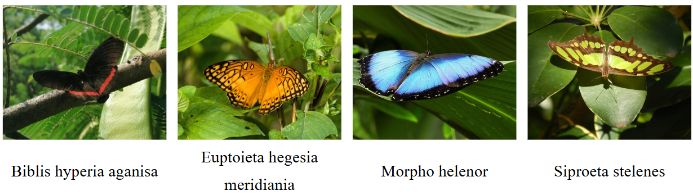

# **Costa Rican Butterfly Classificator**

The following project contains a ConvNet architecture implemented in `pytorch` to classify the following four types of butterflies found in Costa Rica:



1. Siproeta Stelenes
2. Morpho Helenor
3. Euptoieta Hegesia Meridania
4. Biblis Hyperia Aganisa

## Dependencies

To use the code, certain python packages are required. You can install them by running the following command:

```console
pip install -r requirements.txt
```

## Instruction Manual

### Directories

The project contains the following directories when you clone it.

```
butterfly_classificator/
├── checkpoints/
│   └── checkpoint.pth
├── results/
│   ├── epoch_metrics.csv
│   ├── final_results.csv
│   ├── testing_matrix.csv
│   └── training_matrix.csv
├── src/
│   ├── convnet.py
│   ├── csv_writer.py
│   └── trainer.py
└── utils/
    ├── data_augmenter.py
    ├── preprocessor.py
    └── splitter.py

```

1. In `results` you will find `.csv` files with the results from the last training execution. These can be used to plot the data.
2. In `src` you will find the relevant files to train the ConvNet model.
3. In `utils` you will find all files related to preprocessing the images.

To run any file with code you will need a version of the dataset.

### Dataset

The dataset for the project was constructed from photos taken from [Inaturalist](https://www.inaturalist.org/), you can download three datasets that were created for this project:

1. [Initial dataset](https://drive.google.com/file/d/1uCl3I_oUMD8d2EYBZAnucmWhpLXZzWT_/view?usp=sharing) which contains the photos without being split.
2. [Split dataset](https://drive.google.com/file/d/1Mf9fWpDuVJO3eHLfg_6XC7gyZDYCLirb/view?usp=sharing) which contains the photos split into a training, testing and validation split with a 80-10-10 proportion.
3. [Balanced dataset](https://drive.google.com/file/d/1ymGeJ6ZxGsqkf237a0y0AGyOy3pOIjlD/view?usp=sharing) which contains a balanced version of the dataset through data augmentation.

### Auxiliary tools

If you want to create your own split, you can use the auxiliary tools in the `utils` directory to:

1. Resize the images.
2. Split the data.
3. Balance the classes.

#### Resizing the images

The images were resized to `200x200` pixels to be easier to process by the model, to do this you must have a `data` directory with the images and execute the following command:

```console
python preprocessor.py
```

This will create a new directory titled `preprocessed_data`.

#### Splitting the data

To split the data you must have the `preprocessed_data` directory from the previous step and execute the following command:

```console
python splitter.py
```

This will create a new directory titled `split_data`with the following splits:

1. Training: 80% of the images.
2. Testing: 10% of the images.
3. Validation: 10% of the images.

If you want to modify these splits you can change the following line in the code:

```python
splitfolders.ratio(input_path, output=output_path, seed=18, ratio=(0.80, 0.10, 0.10))
```

### Training the ConvNet

Once you either downloaded the dataset or created your own version you can train the model by running the following command inside the `src` directory:

```console
python trainer.py
```

This will update the `.csv` files inside the `results` directory and will output the training process and final results for the following information for `training` and `validation`:

1. Loss
2. Macro Accuracy
3. Macro F1
4. Macro Precision
5. Macro Recall
6. Confusion matrix

### Result visualization

To observe the result you can use the following [colab notebook](https://colab.research.google.com/drive/1Q8SB6P3KZW8EmO355G6YW_CFbi7oqDJB?usp=sharing) in which you can graph the metric results and each confusion matrix from the `.csv` files in the `results` directory.

## Made by

- [Angie Solís Manzano](https://github.com/AngieS23)
- [Luis David Solano Santamaría](https://github.com/GoninDS)
